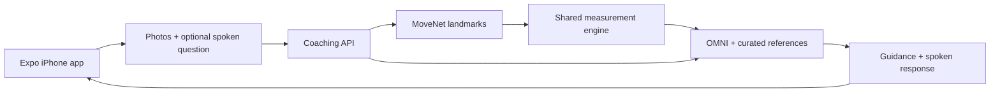

<p align="center">
  
</p>

<h1 align="center">Align</h1>
<p align="center"><strong>See your posture. Know what to try next.</strong></p>
<p align="center">A voice-enabled posture coach for iPhone · Built for Hack the North 2026</p>

A long coding session ends. Your shoulders feel stiff. “Sit up straight” doesn’t tell you much.

**Align turns four photos and a spoken question into measured posture insights and practical guidance.** The app guides your capture, measures visible alignment, and lets you ask a coach about what the camera sees. OMNI brings the conversation to life; Expo brings it to your phone.

## Try the experience

1. **Set up your phone.** The level indicator helps you position it before scanning.
2. **Capture four views.** Follow the human outline through front, right, back, and left. Auto capture waits for three steady, aligned samples; **Capture now** stays available throughout.
3. **See your measurements.** Review the photos alongside supported alignment findings and their confidence limitations.
4. **Ask in your own words.** Try: *“Looking at my posture, what could I change when working at my desk?”* Hear OMNI’s response and read the captions. You can also request a photo-only analysis.
5. **Keep your results.** Save the scan locally and revisit it from your history.

## What makes Align different

**The advice starts with your scan.** A pose model locates body landmarks in the submitted photos. Our measurement engine computes the numbers, and OMNI receives those findings alongside the images and any spoken question.

**The coach has references to work from.** We match findings with curated ergonomic guidance from OSHA and CCOHS. Report instructions ask the coach to explain why each recommendation fits a visible observation, measured finding, or stated goal, and to cite its supporting source.

**The interaction fits the task.** A level guide helps with setup. A human outline shows the requested view. Haptics confirm captures while you are away from the screen. Spoken answers let you keep the conversation going without typing.

The result is a posture check you can ask questions about, with measurements and references you can inspect.

## OMNI: a coach that sees and listens

Align uses the sponsored **YibuAPI OMNI endpoint**, with **Qwen3.5-Omni-Flash** in our demo configuration.

- **Image and audio input:** an interactive turn includes the current camera frame, the recorded question, and server-computed measurements.
- **Four-view reasoning:** the final report reviews the labeled photos together, with relevant posture references and an optional spoken goal.
- **Structured guidance:** reports pass schema, citation-ID, and safety checks before presentation. OMNI then narrates the validated report.
- **Native speech output:** OMNI supplies the spoken responses. There is no separate speech provider; captions remain available when audio is not returned.
- **Sponsor integration:** sponsored calls are recorded in the competition’s usage-audit format. Provider credentials stay on the server.

## Expo: the native experience

Expo connects the camera, sensors, microphone, and speaker into one guided workflow.

| Expo capability | What it does in Align |
| --- | --- |
| **Camera** | Captures the four views and preview images used for framing and stillness checks. |
| **Sensors** | Drives the phone-level indicator during setup. |
| **Audio** | Records spoken questions and plays OMNI’s replies. |
| **Haptics** | Confirms saved captures and completed results. |
| **FileSystem + SQLite** | Manages capture files, cached audio, and saved scan history. |
| **Router** | Connects setup, scanning, results, and past sessions. |

The app runs as a native iPhone development build. Camera work, recording, and playback are coordinated so each step has a clear state and a usable manual path.

## How it works



Pose inference and coaching run on the backend. Saved scan history lives on the device. Users choose whether to enable cloud coaching; local-only capture keeps photos on the phone.

Align provides wellness guidance, not a clinical diagnosis. Its references describe comfortable, task-appropriate positions rather than a universal “perfect posture.” If OMNI is unavailable, the app clearly labels its rule-based scan notes.

## Run it locally

You’ll need **Node.js 22.13+**, npm, an iPhone on the same Wi-Fi network as your computer, and a sponsor-issued OMNI API key.

```sh
npm install
cp .env.example .env
```

In the root `.env`, set `OMNI_API_KEY` and set `OMNI_MODEL=qwen3.5-omni-flash` to match the demo. Then start the API and Expo together:

```sh
npm run iphone
```

Open the QR code with Expo Go. For the native development build, device setup, and verification commands, see the [development guide](docs/DEVELOPMENT.md).

## Explore the implementation

| Location | Responsibility |
| --- | --- |
| [`apps/mobile`](apps/mobile) | Expo / React Native iPhone app |
| [`apps/api`](apps/api) | Coaching API, pose inference, OMNI integration, and evidence catalog |
| [`packages/metrics`](packages/metrics) | Shared measurement and capture-quality logic |
| [`packages/contracts`](packages/contracts) | Validated request and response schemas |
| [`apps/web`](apps/web) | Browser development baseline |

The demo revision passes **194 automated tests** and the full workspace build. Read [how posture guidance is grounded](docs/POSTURE_GROUNDING.md), the [product design](PRODUCT.md), or the [OMNI usage-reporting integration](docs/OMNI_USAGE_REPORTING.md) for more detail.
